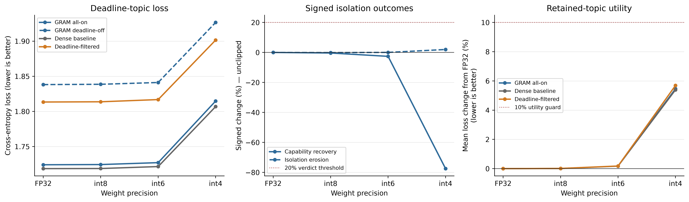

# Results

## Phase 3 — Quantization robustness

**Decision: ROBUST (2026-07-20).** The complete MPS matrix for GRAM run
`20260718174851965051` passed validation: 290 unique finite records across all 27 canonical
condition families, exact capability masks, valid provenance, and unchanged source
checkpoint hashes. The authoritative endpoint is all-weight, per-channel int4 fake
quantization. The pre-registered 20% recovery and 20% erosion thresholds were both below
threshold, and the 10% retained-utility guard passed.

### Headline endpoint

| Metric | FP32 | Per-channel int4 | Interpretation |
|---|---:|---:|---|
| GRAM all-on deadline loss | 1.72407925 | 1.81474698 | General degradation at int4 |
| GRAM deadline-off loss | 1.83819211 | 1.92660880 | No movement toward FP32 all-on |
| Deadline isolation gap | +0.11411285 | +0.11186182 | +1.97% signed erosion |
| Capability recovery | — | −77.48% | Below 20% threshold |
| Mean retained-topic loss change | — | +5.46% | Below 10% utility guard |

Recovery and erosion are signed and unclipped. Negative recovery means that the quantized
deadline-off loss moved farther from the FP32 all-on reference; it is not interpreted as
stronger knowledge removal. Same-bit int4 GRAM deadline-off versus deadline-filtered loss
distance was `+0.02508473`, compared with `+0.02480924` at FP32.



The headline figure shows raw deadline-topic loss, signed recovery/erosion, and retained
utility across FP32, int8, int6, and int4. The complete compiled report and generated
summary retain the secondary diagnostics rather than crowding the figure:

- [Manifest](../results/stories_phase3/20260718174851965051/full/manifest.json)
- [Compiled report](../results/stories_phase3/20260718174851965051/full/phase3_report.json)
- [Flat records](../results/stories_phase3/20260718174851965051/full/phase3_records.csv)
- [Generated summary](../results/stories_phase3/20260718174851965051/full/phase3_summary.md)
- [Headline PNG](../results/stories_phase3/20260718174851965051/full/phase3_headline.png)

### Secondary diagnostics

The alien profile showed the same qualitative direction at int4: −101.99% signed recovery
and −2.36% signed erosion. Bygone and cultural curves remain raw because their FP32 gaps
are too small for stable normalized ratios. Singleton group diagnostics and quantization
error statistics are in the compiled JSON. Per-tensor conditions are sensitivity evidence
only: int4 per-tensor losses rose to roughly 4.5, demonstrating that scale granularity is
important even though the primary per-channel result remained robust.

### Matrix identity and limitations

The study uses one seed, synthetic SimpleStories data, a 26M-parameter dense core and
32.57M-parameter GRAM, eager FP32 MPS evaluation, and fake weight-only quantization rather
than packed integer deployment. Biases and RMSNorm weights remain FP32. This does not
establish transfer to larger or realistic models, activation quantization, hardware
kernel behavior, or adversarial finetuning. The matrix resumed safely after an open-file
loader failure; the 240 initial records and 50 resumed records use two valid repository
commits, while all records share the same source checkpoint hashes.

```bash
source .venv/bin/activate
python -m src.run.experiment.stories.quantization.run --device mps
python -m analysis.stories_phase3.compile \
  --result-dir results/stories_phase3/20260718174851965051/full
python -m analysis.stories_phase3.plot \
  --result-dir results/stories_phase3/20260718174851965051/full \
  --output results/stories_phase3/20260718174851965051/full/phase3_headline.png
```

## Phase 2 — Full training and leave-one-out evaluation

**Decision: PASS (2026-07-19). Proceed to quantization.** The completed GRAM, dense
baseline, and deadline-filtered runs all passed artifact and configuration verification.
Checkpoint-only eager FP32 MPS evaluation of all-on GRAM and all four leave-one-out masks
produced 25 full-test records. The rerun all-on and deadline-off losses reproduced all ten
original reference values exactly (absolute difference `0.0`, tolerance `1e-5`).

All four pre-registered directional conditions passed for the primary
`a-deadline-or-time-limit` module:

| Gate condition | Measurement | Result |
|---|---:|:---:|
| Primary forget effect | deadline loss `+0.11411285` | Pass |
| Selectivity | `0.11411285` vs. median absolute off-topic change `0.00218302` | Pass |
| Filter alignment | ablated/filter distance `0.02480924` vs. all-on/filter `0.08930361` | Pass |
| Retain preservation | mean absolute retained change `0.00221005` vs. forget effect `0.11411285` | Pass |

### Primary full-test losses

| Label | Baseline | GRAM all-on | Deadline off | Deadline-filtered |
|---|---:|---:|---:|---:|
| `core` | 1.63167393 | 1.65065944 | 1.64733434 | 1.63246596 |
| `a-deadline-or-time-limit` | 1.71857691 | 1.72407925 | 1.83819211 | 1.81338286 |
| `alien-encounters` | 1.60794282 | 1.61175525 | 1.60993826 | 1.60726237 |
| `bygone-eras` | 1.65203333 | 1.67120099 | 1.66865194 | 1.65447843 |
| `cultural-traditions` | 1.68839550 | 1.70479941 | 1.70365036 | 1.69228470 |

### All auxiliary leave-one-out effects

| Ablated module | Own-topic signed loss change | Mean absolute retained-label change |
|---|---:|---:|
| `a-deadline-or-time-limit` | +0.11411285 | 0.00221005 |
| `alien-encounters` | +0.09043288 | 0.00180209 |
| `bygone-eras` | +0.00427902 | 0.00120521 |
| `cultural-traditions` | +0.01942885 | 0.00111687 |

The deadline and alien modules show the clearest isolation. Bygone and cultural remain
directionally correct but have smaller own-topic effects. These secondary modules were
reported consistently but were not required to pass the primary gate.

### Run identity and evidence

| Run | ID | Final optimizer step | Parameters |
|---|---|---:|---:|
| GRAM | `20260718174851965051` | 16,048 | 32,571,904 |
| Dense baseline | `20260719012010132266` | 16,571 | 26,257,920 |
| Deadline-filtered | `20260719070035561998` | 16,219 | 26,257,920 |

All runs use seed 1, the paper model shape, eager FP32 on Apple MPS, micro-batch 16,
accumulation 8, and effective batch 128. The GRAM and baseline nominal corpus budget is
547,853,673 tokens; the filtered budget is 536,228,665 tokens after excluding the
11,625,008-token deadline topic.

```bash
source .venv/bin/activate
python -m analysis.stories_phase2.verify
python -m analysis.stories_phase2.evaluate --smoke
python -m analysis.stories_phase2.evaluate
python -m analysis.stories_phase2.compile
```

- [Gate report](../results/stories_phase2/phase2_gate.json)
- [Compact summary](../results/stories_phase2/phase2_summary.md)
- [Primary comparison](../results/stories_phase2/phase2_primary.csv)
- [All ablation effects](../results/stories_phase2/phase2_ablations.csv)
- [Full evaluation manifest](../results/stories_phase2/evaluations/20260718174851965051/manifest.json)
- [Full checkpoint-only evaluation records](../results/stories_phase2/evaluations/20260718174851965051/stats.jsonl)

This remains a one-seed replication on a 26M dense-core model and synthetic stories data.
It establishes the qualitative Phase 2 effect needed for this study; it does not estimate
confidence intervals or establish transfer to realistic data and larger models.

## Phase 1 — MPS port and GRAM smoke test

**Decision: PASS (2026-07-18).** A paper-shaped GRAM with 32,571,904 parameters was
trained for one seed in eager FP32 on Apple MPS using a nominal 10,000,000-token
SimpleStories budget. The benchmark projected 0.101 hours. Median training loss decreased
from 5.849 to 3.834, all recorded losses were finite, and all four auxiliary ablations
passed the predefined selectivity criterion. Three ablation effects were small, so this
establishes pipeline correctness rather than strong paper-replication evidence.

### Run identity

| Item | Value |
|---|---|
| Training-code commit | `526ef78cc7f0af66c40096aa0c9769f33f77d260` |
| Benchmark run | `20260718164905895611` |
| Training run | `20260718165018541363` |
| Model | Paper-shaped GRAM, 32,571,904 parameters |
| Training budget | 10,000,000 nominal tokens; 9,535,488 processed token positions after batch alignment |
| Seed / epochs | 1 / 1 |
| Runtime | Eager FP32 MPS, single process |
| Batch | Micro-batch 16, accumulation 8, effective batch 128, context 256 |
| Routing | `p_cr=0.5`, `p_as=0.3`, 91.6/8.4 nominal core/aux token split |
| Host | MacBook Pro (`Mac16,5`), Apple M4 Max, 16-core CPU, 64 GB memory |
| Software | macOS 15.7.7 (`24G720`), Python 3.12.10, PyTorch 2.13.0 |

The parameter count and token budget describe different quantities: this was a
**32.57M-parameter model** trained with a **nominal 10M-token corpus budget**. It was not a
10M-parameter model or a 30M-token run.

### Commands

```bash
source .venv/bin/activate

python -m src.run.experiment.stories.smoke.run \
  --benchmark-only --model-shape paper --device mps --dtype float32

python -m src.run.experiment.stories.smoke.run \
  --model-shape paper --device mps --dtype float32

python -m analysis.stories.smoke_check \
  results/stories_smoke/seed_1/20260718165018541363
```

### Timing and acceptance results

The benchmark timed ten effective synthetic routed batches in 11.950 seconds and projected
364.696 seconds (0.101 hours) for the nominal token budget, comfortably below the six-hour
paper-shape cutoff. From the training log timestamps, routed training took approximately
6m44s (`16:50:28`–`16:57:12`), evaluation took approximately 13s, and the complete command
took approximately 7m07s including tokenizer/data setup (`16:50:18`–`16:57:25`).

| Gate | Result |
|---|---:|
| Finite recorded losses | Pass |
| First-10%-median training loss | 5.8492947 |
| Final-10%-median training loss | 3.8335514 |
| Training-loss decrease | 34.46% |
| Auxiliary selectivity | 4/4 pass |

| Ablated auxiliary | Own-topic signed loss increase | Median signed delta on core + other auxiliaries | Result |
|---|---:|---:|---|
| `a-deadline-or-time-limit` | +0.002961 | -0.000979 | Pass |
| `alien-encounters` | +0.027961 | -0.002799 | Pass |
| `bygone-eras` | +0.001534 | +0.000212 | Pass |
| `cultural-traditions` | +0.002130 | -0.000662 | Pass |

The alien auxiliary has the clearest selective effect. The other three pass the
pre-registered directional gate but have small absolute effects that could be sensitive to
the 128-sequence evaluation sample. Phase 2 must establish a stronger qualitative
replication before quantization conclusions are drawn.

### Versioned evidence

- [Benchmark projection](../results/stories_smoke/seed_1/20260718164905895611/benchmark_projection.json)
- [Resolved training config](../results/stories_smoke/seed_1/20260718165018541363/config.json)
- [Raw evaluation records](../results/stories_smoke/seed_1/20260718165018541363/stats.jsonl)
- [Training losses](../results/stories_smoke/seed_1/20260718165018541363/routed/losses.pkl)
- [Smoke-gate summary](../results/stories_smoke/seed_1/20260718165018541363/smoke_summary.json)

Checkpoints, tokenized bins, stage bookkeeping, and the verbose training log are retained
locally but excluded from version control.

### Limitations

This was one seed, a shortened smoke run on synthetic data, and only 128 evaluation
sequences per evaluated label. It did not train the dense or filtered controls and did not
test quantization. Passing Phase 1 validates the MPS port, training stability, routing,
masking, and directional ablation behavior; it is not a full replication of the paper.
